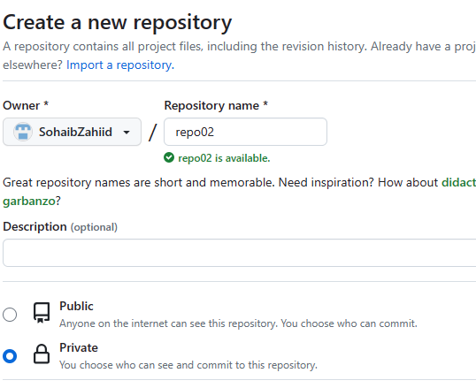
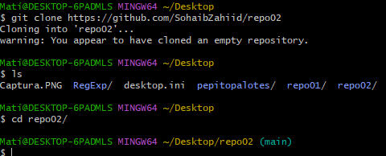

# Ejercicios GIT
1. Ejercicio 2  
  2.1. Si creamos un repositorio en GitHub sería considerado un repositorio remoto  
    
  2.2. `git clone https://github.com/SohaibZahiid/repo02`: Clona el repositorio remoto en local  
  2.3. Creamos fichero **readme.md**  
    
  2.4. `git push` Hacemos push a repositorio GitHub
  

